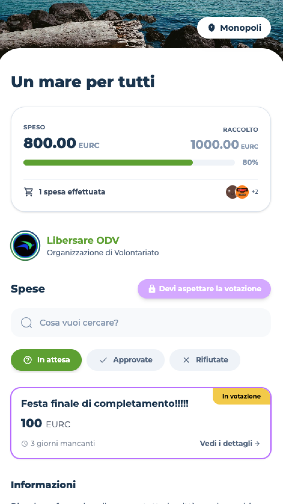
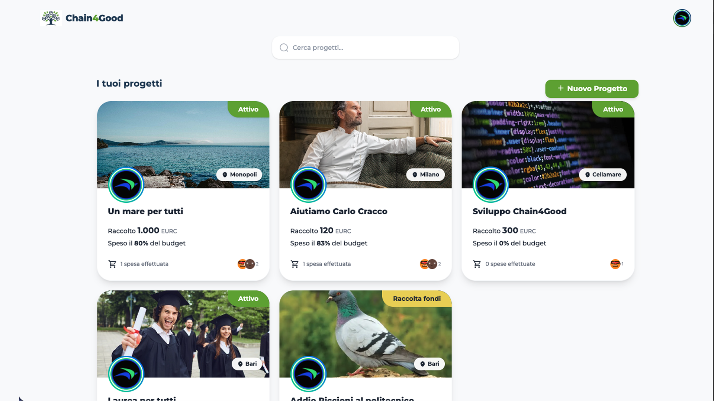
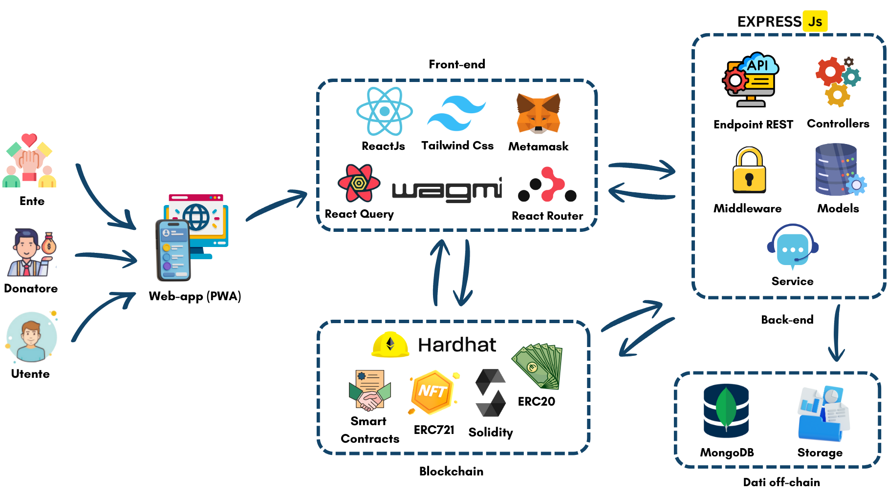

<p align="center">
  
</p>

<p align="center">
    
    
    
    <br>
    <a href="https://wakatime.com/badge/user/c82f4683-34a5-4724-a5f4-5c2a6f37d55c/project/8584fed1-f592-48a0-bc57-e7dae4a23ae1.svg">
        
    </a>
</p>

<p align="center">
  <i>*Il tempo tracciato da WakaTime si riferisce esclusivamente alla scrittura attiva del codice e NON include le ore dedicate alla ricerca, alla progettazione e alla risoluzione di bug. <br><b><u>È Riferito solo a Jonathan Caputo</u></b></i>
</p>

## Indice

* [Cos'è Chain4Good](#cosè-chain4good)
* [Chi siamo](#chi-siamo)
* [Obiettivi e Funzionalità](#obiettivi-e-funzionalità)
* [Architettura del Sistema](#architettura-del-sistema)
* [Installazione](#installazione)
* [Comandi Utili](#comandi-utili)

# Chain4Good
> *Il Crowdfunding trasparente e decentralizzato.*
<p align="center">

</p>

## Cos'è Chain4Good
**Chain4Good** è una piattaforma di **Donation-based Crowdfunding (DCF)** decentralizzata, progettata specificamente per supportare le iniziative degli **Enti del Terzo Settore**. 
<br><br>A differenza delle piattaforme tradizionali, Chain4Good utilizza la tecnologia blockchain per garantire che ogni donazione sia tracciabile, immutabile e che i fondi vengano rilasciati solo a fronte di spese reali approvate dalla comunità dei donatori

<p align="center">

</p>

## Chi siamo
Il progetto è stato ideato e sviluppato da:
* **Jonathan CAPUTO** 
* **Angelica DE FEUDIS** 
* **Luca GENTILE** 


## Obiettivi e Funzionalità
L'obiettivo principale è restituire al donatore un ruolo attivo, trasformando la donazione in un processo sicuro e verificabile.
* **Custodia Decentralizzata**: I fondi raccolti non vengono erogati immediatamente, ma restano vincolati in uno Smart Contract.
* **Erogazione Incrementale**: L'Ente può accedere ai fondi solo presentando richieste di spesa specifiche corredate da preventivi.
* **Votazione Democratica**: I donatori votano per approvare o negare il rilascio dei fondi per ogni singola spesa[cite: 48, 171].
* **Utilizzo di Stablecoin**: Per evitare la volatilità, il sistema opera esclusivamente con stablecoin come **EURC** o **USDC**.

## Architettura del Sistema
Chain4Good utilizza un'architettura ibrida che combina la scalabilità del Web2 con la sicurezza del Web3 (Stack **MERN + Web3**):
* **Front-end**: React.js, Tailwind CSS, React Router e TanStack Query.
* **Back-end**: Node.js, Express.js e TypeScript.
* **Database**: MongoDB (Mongoose) per i metadati off-chain.
* **Blockchain**: Smart Contract in Solidity gestiti tramite Hardhat.

<p align="center">

</p>

## Installazione

### Requisiti preliminari
* Docker e Docker Compose installati.
* Wallet Ethereum (es. MetaMask) configurato.

### Passaggi:
1. Clona la repository:
   ```bash
   git clone [https://github.com/Jonnycp/Chain4Good.git](https://github.com/Jonnycp/Chain4Good.git)
   cd Chain4Good

2. Configura il `.env` e l'enviroment nel `docker-compose.yml`
    ```
    VITE_BACKEND_URL=http://localhost:3000
    VITE_HARDHAT_RPC_URL=http://http://localhost:8545
    
    NODE_ENV=production
    PORT=3000
    MONGO_URI=mongodb://mongodb:27017/chain4good
    RPC_URL=http://http://localhost:8545
    FRONTEND_URL=http://http://localhost:5173
    DEPLOYMENT_ADDRESSES_PATH=/shared/ignition/deployments/chain-31337/deployed_addresses.json
    ```


3. Avvia i container docker
    ```bash
    docker compose up --build
    
4. Visita <a href="localhost:5173">localhost:5173</a> per il frontend e loggati con Metamask

## Comandi utili

Assegna o rimuovi NFT ente verificato
```bash
docker exec chain4good_blockchain npx hardhat manage-ente <address> <mint | burn>
```
Assegna token EURC secondo il contratto Mock o ETH
```bash
docker exec chain4good_blockchain npx hardhat giveCash <address> <amount> <eurc | eth> --network localhost
```
Ripristino database
```bash
docker cp </percorso/al/.archive> chain4good_db:/backup_chain4good.archive

docker exec -it chain4good_db mongorestore --archive=/backup_chain4good.archive --drop
```